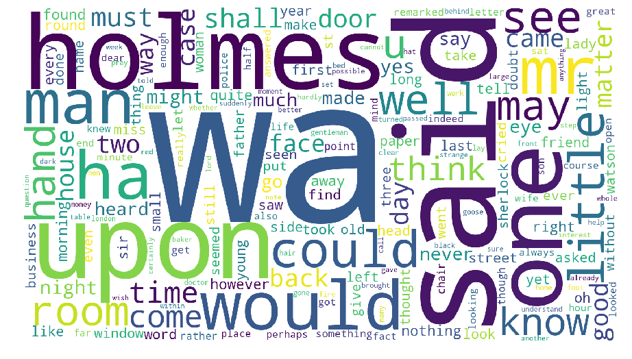

-----------------
**Book Used : [The Adventures of Sherlock Holmes by Arthur Conan Doyle](http://www.gutenberg.org/ebooks/1661)**

-------------------

# Importing Requirements

## Importing all the necessary packages required for the project


```python
import nltk
import re
import numpy as np
import pandas as pd
import matplotlib.pyplot as plt
import plotly.graph_objects as go
from wordcloud import WordCloud
from nltk.stem import WordNetLemmatizer
import plotly
from IPython.display import Image
%matplotlib inline
```

## Importing the required lists which are required later.


```python
stopwords = nltk.corpus.stopwords.words('english')
```

----------------

# Loading and Preprocessing Text as T

## Import the text, lets call it as T


```python
T = open("Adventures Of SH.txt", 'r').read()
print("...\n" + T[680:999] + "\n...")
```

    ...
    
    cover
    
    
    
    The Adventures of Sherlock Holmes
    
    
    
    by Arthur Conan Doyle
    
    
    
    Contents
    
    
       I.     A Scandal in Bohemia
       II.    The Red-Headed League
       III.   A Case of Identity
       IV.    The Boscombe Valley Mystery
       V.     The Five Orange Pips
       VI.    The Man with the Twisted Lip
       VII.   The Adventure of the Blue 
    ...


## Simple text pre-processing and Tokenize the text T

### Removing the sentences that start with Roman Numbers and removing extra whitespace characters


```python
T1 = re.sub(r"(^ *[IXV]+\..*$)","\n", T, flags = re.MULTILINE)
T2 = re.sub(r"\s\s+", "\n", T1)
print("...\n" + T2[672:998] + "\n...")
```

    ...
    The Adventures of Sherlock Holmes
    by Arthur Conan Doyle
    Contents
    To Sherlock Holmes she is always _the_ woman. I have seldom heard him
    mention her under any other name. In his eyes she eclipses and
    predominates the whole of her sex. It was not that he felt any emotion
    akin to love for Irene Adler. All emotions, and that one 
    ...


### Removing header and footer of the book that is not required.


```python
T3 = re.findall("Contents([\s\S]*)End of the Project", T2)[0]
print("...\n" + T3[:304] + "\n...")
```

    ...
    
    To Sherlock Holmes she is always _the_ woman. I have seldom heard him
    mention her under any other name. In his eyes she eclipses and
    predominates the whole of her sex. It was not that he felt any emotion
    akin to love for Irene Adler. All emotions, and that one particularly,
    were abhorrent to his cold, 
    ...


### Converting the corpus entirely in lower case


```python
T = T3.lower()
print("...\n" + T[:304] + "\n...")
```

    ...
    
    to sherlock holmes she is always _the_ woman. i have seldom heard him
    mention her under any other name. in his eyes she eclipses and
    predominates the whole of her sex. it was not that he felt any emotion
    akin to love for irene adler. all emotions, and that one particularly,
    were abhorrent to his cold, 
    ...


### Creating english tokens containg alphanumeric characters only.


```python
tokens = re.sub(r"[^A-Za-z0-9]", " ", T).split()
print(tokens[100:110])
```

    ['a', 'gibe', 'and', 'a', 'sneer', 'they', 'were', 'admirable', 'things', 'for']


### Lemmatizing the tokens using the NLTK Library


```python
tokens = [WordNetLemmatizer().lemmatize(word) for word in tokens]
print(tokens[100:110])
```

    ['a', 'gibe', 'and', 'a', 'sneer', 'they', 'were', 'admirable', 'thing', 'for']


----------------------

# Analyze the frequency distribution of tokens in T

## Finding the frequency of words


Creating a dictionary and dataframe for word and its corresponding frequency


```python
dicti = dict()
for tok in tokens:
    dicti[tok] = dicti.get(tok, 0) + 1
dicttup = sorted(dicti.items(), key=lambda x: x[1], reverse=True)
tokdf = pd.DataFrame.from_records(dicttup, columns=['Token', 'Frequency'])
```

## Histogram plot of frequencies

### Plot for frequencies $\lt$ 50


```python
fig = go.Figure(data=[go.Histogram(x=tokdf[tokdf["Frequency"]<50]["Frequency"])])
fig.update_layout(
    title=go.layout.Title(
        text="For frequencies < 50",
        xref="paper",
        x = 0.5,
    ),
    xaxis=go.layout.XAxis(
        title=go.layout.xaxis.Title(
            text="Frequency of the word",
            font=dict(
                family="Courier New, monospace",
                size=18,
                color="#7f7f7f"
            )
        )
    ),
    yaxis=go.layout.YAxis(
        title=go.layout.yaxis.Title(
            text="Count of word's frequency",
            font=dict(
                family="Courier New, monospace",
                size=18,
                color="#7f7f7f"
            )
        )
    )
)
fig.show()
```

------------------

# Create  a Word Cloud of T

## WordCloud based on frequencies (with stopwords)


```python
wc = WordCloud(width = 1600, height = 900, background_color ='white').generate_from_frequencies(frequencies=dicti)
plt.figure(figsize = (16, 9), facecolor = None)
plt.box(False)
plt.axis('off')
plt.imshow(wc)
```


## WordCloud based on frequencies (without stopwords)


Creating a dictionary of words excluding stopwords and their frequencies


```python
dictj = dict()
for tok in tokens:
    if tok not in stopwords:
        dictj[tok] = dictj.get(tok, 0) + 1
dicttup = sorted(dictj.items(), key=lambda x: x[1], reverse=True)
tokdf_ws = pd.DataFrame.from_records(dicttup, columns=['Token', 'Frequency'])
```


Plotting their WordCloud


```python
wc = WordCloud(width = 1600, height = 900, background_color ='white').generate_from_frequencies(frequencies=dictj)
plt.figure(figsize = (16, 9), facecolor = None)
plt.box(False)
plt.axis('off')
plt.imshow(wc)
```




-------------

# Analysing relationship between word length and frequency


```python
tokdf["TokenLength"] = tokdf["Token"].apply(lambda x:len(x))
lenvsfreq = tokdf.groupby("TokenLength")["Frequency"].agg('sum')
fig = go.Figure(data=go.Scatter(x=lenvsfreq.index, y=lenvsfreq))
fig.update_layout(
    title=go.layout.Title(
        text="Word Length Vs Frequency",
        xref="paper",
        x = 0.5,
    ),
    xaxis=go.layout.XAxis(
        title=go.layout.xaxis.Title(
            text="Length of the word",
            font=dict(
                family="Courier New, monospace",
                size=18,
                color="#7f7f7f"
            )
        )
    ),
    yaxis=go.layout.YAxis(
        title=go.layout.yaxis.Title(
            text="Frequency of the word",
            font=dict(
                family="Courier New, monospace",
                size=18,
                color="#7f7f7f"
            )
        )
    )
)
fig.show()
```
